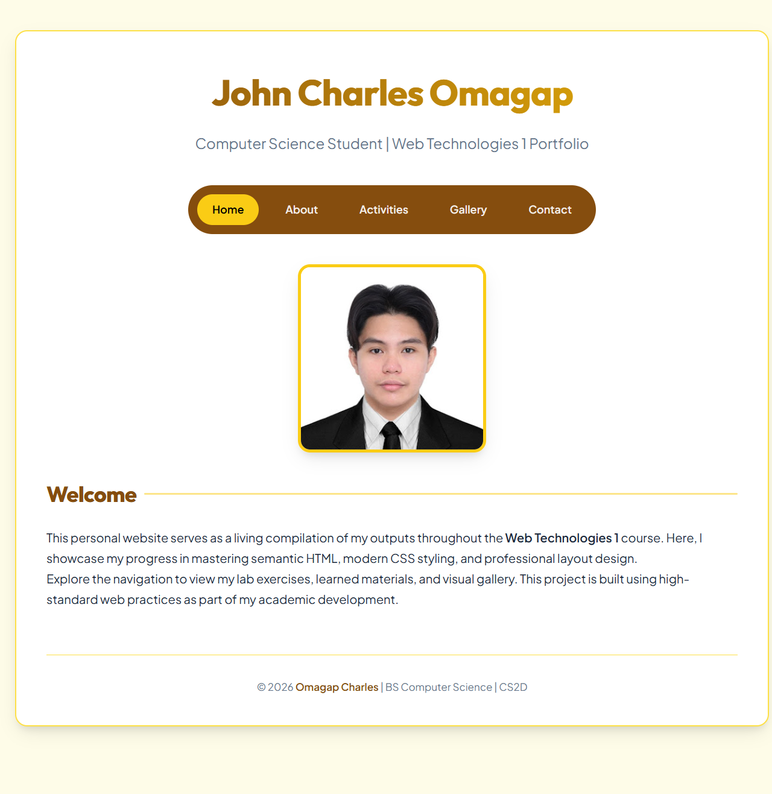
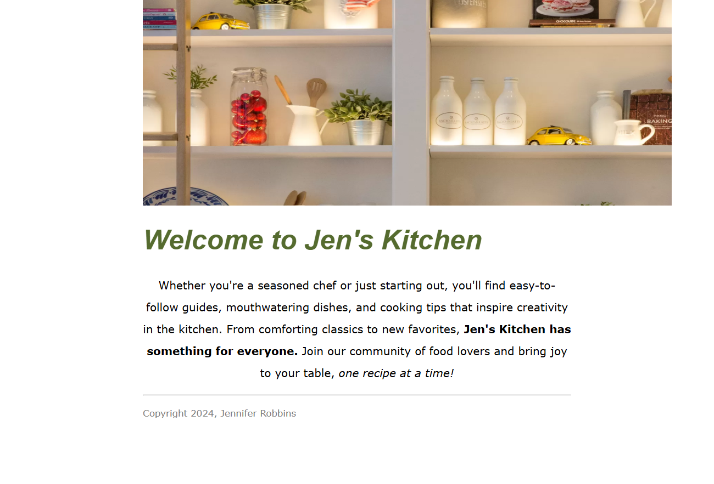

# Web Technologies 1 - Laboratory Activities (2026)

This repository contains a compilation of laboratory exercises and practical outputs for the **Web Technologies 1** course (Section CS2D).

## 🚀 Projects Overview

### 1. 📂 WebTech 1 Personal Website (Portfolio Hub)
The central hub for all laboratory outputs, featuring a professional design, responsive layout, and integrated navigation.

**Key Features:**
- Custom Yellow & Navy aesthetic.
- Responsive CSS Grid layout.
- Centralized access to all laboratory exercises.



---

### 2. 🍳 Kitchen Lab Exercise (Week 2-1)
An exploration of semantic HTML structure and modern CSS styling focused on a kitchen-themed landing page.

**Key Features:**
- Semantic HTML5 tags.
- Professional typography and spacing.
- Integrated high-quality imagery.



---

### 🦢 3. Black Goose Bistro (Week 2-2)
A practical exercise focusing on advanced text formatting, lists, and restaurant-style menu layouts.

**Key Features:**
- Menu structure using HTML lists.
- Image integration and alignment.
- Professional restaurant aesthetic.


---

## 🏗️ Folder Structure
```
.
├── WebTech1_PersonalWebsite/   # Main Portfolio Hub
├── Week 2 - Kitchen Lab/        # Exercise 2-1
├── Week 2 Day 2 - Black Goose Bistro/ # Exercise 2-2
└── screenshots/                # Project Previews
```

## 🛠️ Technologies Used
- **HTML5**: Semantic structure and content.
- **CSS3**: Modern layouts, transitions, and custom themes.
- **Google Fonts**: Premium typography.

---
&copy; 2026 **Omagap Charles** | BS Computer Science | CS2D
